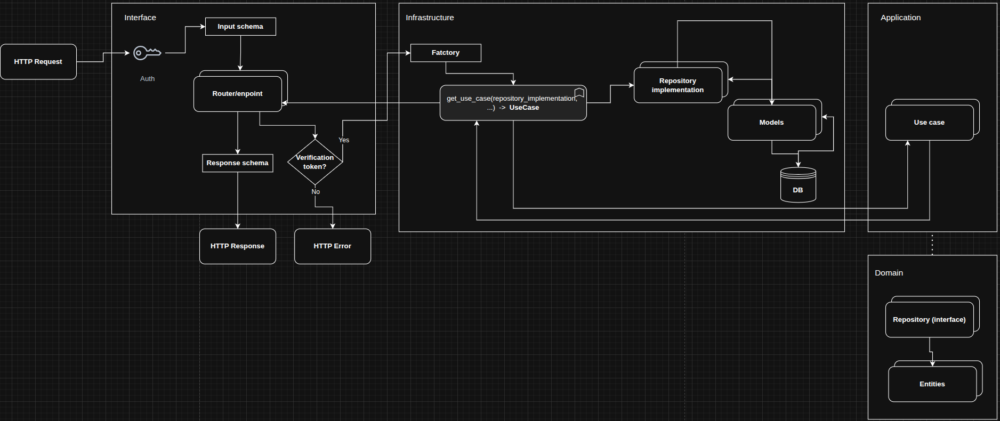

README versión en [🇪🇸 Español](docs/README.es.md)

# Showcase REST API for managing service queues in businesses.

This project showcases how to build a well-structured API using the FastAPI framework and industry best practices.
It follows a clean, scalable, and maintainable architecture, includes basic user security configurations, and serves as a reference for teams adopting FastAPI for their backend development.

## Application scope

The API addresses a real-world problem observed in the healthcare sector and institutions with counter service, where waiting times are two or three times longer than the actual service time. This is mainly because there is no separation of priorities for each request. In other words, clients seeking general inquiries share the same queue with those scheduling medical appointments or handling external procedures, causing simpler requests to be delayed by those that require longer service times.


The API enables queue management by organizing them according to priority, aiming to prevent queues with too many clients and long waiting times for simple requests. It also automates client selection and distribution across queues, allowing the reassignment of clients to empty queues.

The solution is scalable and adaptable to different scenarios where queue management is critical.


The project implements Clean Architecture. Operations are asynchronous to ensure parallel processing and improved efficiency. A relational database was used, along with the OAuth2.0 protocol and JWT for login and endpoint security.

Modules:

- Authorization: Handles user authentication
- Users: Manages system users
- Priorities: Manages the priority levels for queues or clients
- Roles: Manages user roles
- Permissions: Displays the permissions associated with each role
- Customers: Manages the clients within each queue
- Queues: Manages the queues in the system

## Tech-stack

Core Technologies:

- FastAPI (0.115.6)
- SQLAlchemy (2.0.36): supports asynchronous operations
- SQLModel (0.0.22): used for database creation
- Pydantic (2.10.4): defines schemas for data transfer
- Uvicorn (0.34.0): local server
- Passlib (1.7.4): encryption

## Architecture

- Clean architecture: separation of responsibilities using four layers
  - Domain
  - Application
  - Interfaces
  - Infrastructure


File system

    .
    ├── asgi.py
    ├── colas.py
    ├── docker-compose.yml
    ├── migrations
    ├── README.md
    ├── requirements
    ├── src
    │   ├── application
    │   │   └── use_cases
    │   ├── app.py
    │   ├── config.py
    │   ├── database.py
    │   ├── domain
    │   │   ├── constants.py
    │   │   ├── entities
    │   │   ├── exceptions.py
    │   │   └── repositories
    │   ├── infrastructure
    │   │   ├── dependencies
    │   │   ├── models
    │   │   ├── repositories
    │   │   └── security
    │   │       └── security.py
    │   ├── __init__.py
    │   ├── interfaces
    │   │   └── api
    │   │       └── v1
    │   │           ├── routers
    │   │           └── schemas
    │   └── utils
    │       ├── fill_db.py
    │       ├── logger.py
    │       ├── mapping_to_dict.py
    │       ├── reset_order_numbers.py
    │       └── schedule_restart.py

- asgi: configuration file for starting the API
- docker-compose.yml: container configuration that initializes the database
- migrations: folder storing database migration files
- README: project documentation
- requirements: contains project dependencies for both development and production
- src/domain: defines business rules
  - entities: business entities and DTOs
  - repositories/interfaces: declaration of functionality signatures
  - constants: permission values (useful for quick access)
  - exceptions: handling of technical and business exceptions
- src/application: orchestrates business rules within the application
  - use_cases: business rules applied in the app
- src/interfaces: exposes API endpoints
  - routers: endpoint definitions
  - schemas: defines objects for data transfer between client and server (end user)
  - exception_handlers: translates exceptions into user-friendly messages
- src/infrastructure: implements the abstractions
  - dependencies: contains factories and dependencies to avoid external library coupling in core layers
  - models: database model definitions
  - repositories: implementation of repositories defined in the domain layer
  - security: configuration of OAuth2.0 and JWT tokens
- src/utils: logging configuration, fake data, and mappings
- .env: environment variables

## Security:

- Oatuh2.0: handles login and endpoint protection
- JWT: transfers user information

Example of the token validation function


## Endpoints and expected responses

Below is an example of an endpoint for creating a new user, along with its expected response schema.

Endpoint: Create new user

```python

@router.post("", response_model=ViewUser)
    async def create_user(user_data: UserCreate,
                        user_use_case: UserUseCase = Depends(
                            get_user_use_case),
                        _:TokenData = Depends(require_permission(module=module,permission=Permission.CREATE.value))):
        user = await user_use_case.create(data_obj=DtoUserCreate(**user_data.model_dump()))
        return ViewUser(**asdict(user))

```

Expected output:

Example schema reponse create user


```json
# JSON Response

{
  "id": "3fa85f64-5717-4562-b3fc-2c963f66afa6",
  "user_name": "string",
  "first_name": "string",
  "last_name": "string",
  "state": true,
  "role_id": "3fa85f64-5717-4562-b3fc-2c963f66afa6",
  "created_date": "2025-10-17T03:03:49.172Z",
  "updated_date": "2025-10-17T03:03:49.172Z"
}

```

## Dataflow

The following diagram shows the data flow between the four layers of the API.



The data flow begins in the interfaces layer, where HTTP requests are received. All users must first authenticate to obtain a JWT token, which is then used to authorize access to protected endpoints according to their assigned permissions.

Depending on the permission verification, the request is either processed or rejected with an HTTP response error. If the request is valid, a factory is executed to inject the necessary dependencies for the use case execution — in this case, the implementation of repositories.

    Note: Each repository implemented in the infrastructure layer was previously defined in the domain layer using an interface.

The implemented repositories perform CRUD operations on the database using ORM-defined models. The result of these operations is returned to the use case and then sent back to the interfaces layer, where it is transformed into a response schema and returned to the client.

## Project scope and limitations

This showcase focuses on describing the architecture, data flow, and technical details used in the API’s development.
Repositories and use cases make use of dependency injection, although this concept is not explored in depth to maintain a clear and concise project description.
