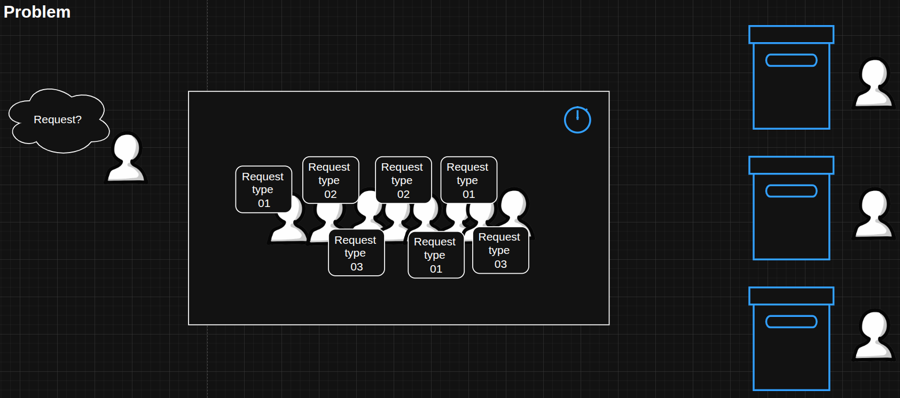
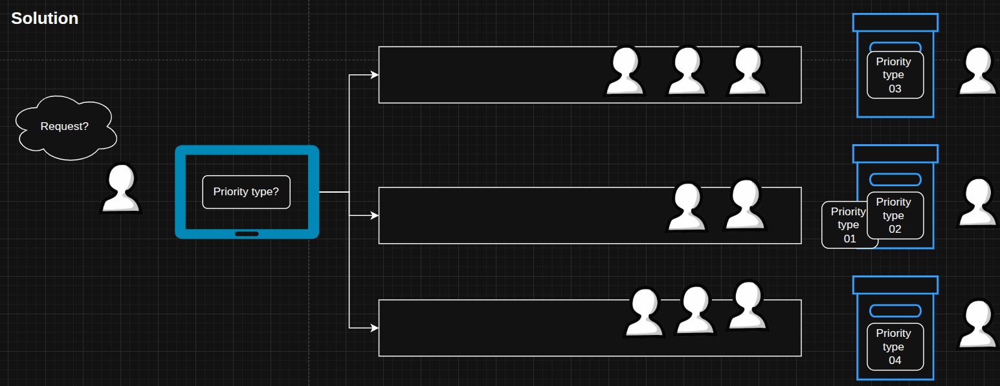
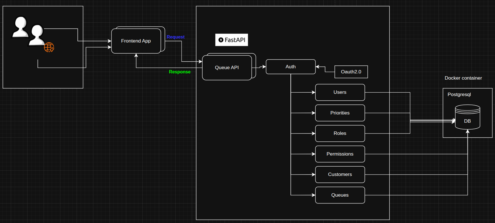
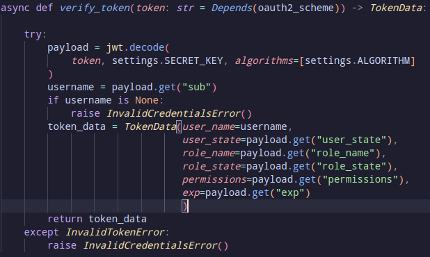
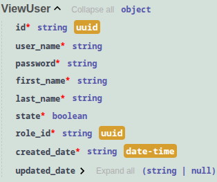
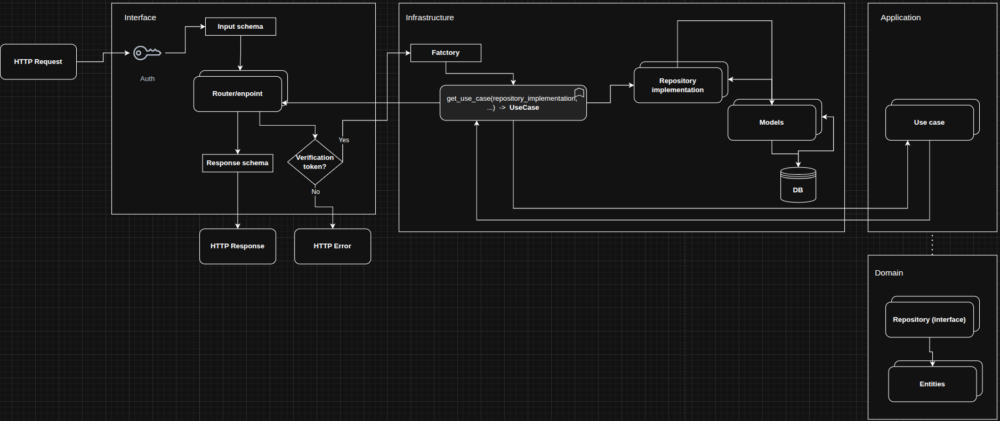

# Showcase de una API REST para la gestión de colas de servicio en empresas.

Este proyecto muestra cómo crear una API bien estructurada utilizando el framework FastAPI y las mejores prácticas del sector. Sigue una arquitectura limpia, escalable y fácil de mantener, incluye configuraciones básicas de seguridad para el usuario y sirve de referencia para los equipos que adoptan FastAPI para su desarrollo backend.

## Ambito de la aplicación

La API resuelve un problema real, observado en el sector salud e instituciones con atención en ventanilla, donde los tiempos de atención son dos o tres veces más que el tiempo en el que se da la respuesta. Esto debido principalmente a que no existe una separación de prioridades por cada solicitud, es decir, clientes que van por una consulta general comparten cola con clientes que van por citas médicas o tramites externos. Encontrando que las solicitudes más simples se ven retrasadas por solicitudes que requieren mayor tiempo de atención.



La API permite la administración de colas organizandolas por prioridad, con la finalidad de evitar colas con demasidos clientes y tiempos de espera largos para solicitudes simples. Además, automatiza la selección y distribución de clientes en cada cola, pudiendo reasignar clientes en colas vacías.

La solución es escalable y se adapta a diferentes escenarios donde la gestión de colas sea crítica.



El proyecto implementó clean architecture, las operaciones son asincronas para garantizar operaciones en paralelo y una mejor eficiencia, se empleó una base de datos relacional, y el protocolo Oauth2.0 junto JWT, para el inicio de sesión y seguridad de los endpoints.

Modulos:

- Authorization: relacionado con el inicio de sesión
- Users: administra los usuarios del sistema
- Priorities: administra las prioridades que puede tener una cola o un cliente
- Roles: administra los roles de cada usuario
- Permissions: muestra los permisos asociados a cada role
- Customers: administra los clientes de cada cola
- Queues: administra las colas en el sistema

## Tech-stack

Tecnologías principales:

- Fastapi (0.115.6)
- SqlAlchemy (2.0.36): soporte de operaciones asincronas.
- Sqlmodel (0.0.22): creación de la base de datos
- Pydantic (2.10.4): creación de schemas para la transferencia de datos
- uvicorn (0.34.0): servidor local
- Passlib (1.7.4): encriptación

## Arquitectura

- Clean architecture: separación de responsabilidades usando cuatro capas
  - Domain
  - Application
  - Interfaces
  - Infrastructure



Sistema de archivos

    .
    ├── asgi.py
    ├── colas.py
    ├── docker-compose.yml
    ├── migrations
    ├── README.md
    ├── requirements
    ├── src
    │   ├── application
    │   │   └── use_cases
    │   ├── app.py
    │   ├── config.py
    │   ├── database.py
    │   ├── domain
    │   │   ├── constants.py
    │   │   ├── entities
    │   │   ├── exceptions.py
    │   │   └── repositories
    │   ├── infrastructure
    │   │   ├── dependencies
    │   │   ├── models
    │   │   ├── repositories
    │   │   └── security
    │   │       └── security.py
    │   ├── __init__.py
    │   ├── interfaces
    │   │   └── api
    │   │       └── v1
    │   │           ├── routers
    │   │           └── schemas
    │   └── utils
    │       ├── fill_db.py
    │       ├── logger.py
    │       ├── mapping_to_dict.py
    │       ├── reset_order_numbers.py
    │       └── schedule_restart.py

- asgi: archivo de configuración para el inicio de la API
- docker-compose.yml: configuración del contenedor que inicia la base de datos.
- migrations: carpeta que almacena las migraciones a la base de datos
- README: documentación del proyecto
- requirements: contiene las dependencias del proyecto para desarrollo y producción
- src/domain: definición de las reglas del negocio
  - entities: entidades del negocio y DTOs
  - repositories/interfaces: firma de las funcionalidades
  - constant: valores de los permisos (útil para un acceso rápido)
  - exceptions: manejo de excepciones técnicas y del negocio
- src/application: orquestador de las reglas del negocio en la aplicación
  - use_cases: reglas del negocio en la app
- src/interfaces: exposición de endpoints
  - routers: definición de endpoints
  - schemas: definición de los objetos para la trasnferencia de información con el cliente (usuario final)
  - exception_handlers: traducción de las excepciones a lenguaje de usuario
- src/infrastructure: implementación de las abstracciones
  - dependencies: contiene factories y depencias para evitar la dependecia de librerías externas en las capas principales.
  - models: definición de los modelos de base de datos
  - repositories: implementación de los repositories definidos en la capa dominio
  - security: configuración de oauth2.0 y token con jwt
- src/utils: configuraciones logs, fake datos, mappings.
- .env: variables de entorno

## Seguridad:

- Oatuh2.0: inicio de sesión y protección de endpoints
- JWT: traslado de información

Ejemplo de la función de validación de token



## Endpoints y respuestas esperada

A contiuación se muestra un ejemplo de un endpoint para la creación de un nuevo usuario, junto con su esquema de respuesta esperado.

Endpoint: Crear nuevo usuario

```python

@router.post("", response_model=ViewUser)
    async def create_user(user_data: UserCreate,
                        user_use_case: UserUseCase = Depends(
                            get_user_use_case),
                        _:TokenData = Depends(require_permission(module=module,permission=Permission.CREATE.value))):
        user = await user_use_case.create(data_obj=DtoUserCreate(**user_data.model_dump()))
        return ViewUser(**asdict(user))

```

Salida esperada:

Example schema reponse create user



```json
# JSON Response

{
  "id": "3fa85f64-5717-4562-b3fc-2c963f66afa6",
  "user_name": "string",
  "first_name": "string",
  "last_name": "string",
  "state": true,
  "role_id": "3fa85f64-5717-4562-b3fc-2c963f66afa6",
  "created_date": "2025-10-17T03:03:49.172Z",
  "updated_date": "2025-10-17T03:03:49.172Z"
}

```

## Dataflow

El siguiente diagrama muestra el flujo de datos entre las cuatro capas de la API.



El flujo de datos inicia en la capa interfaces, donde se reciben las solicitudes HTTP. Todos los usuarios previamente deben autenticarse para obtener un token JWT, el cual, es utilizado para autorizar el acceso a los endpoints protegidos según los permisos asociados.

Dependiendo de la verificación de permisos, la solicitud se procesa o se rechaza con un HTTP response error. Si la solicitud es válida, se ejecuta un factoy que inyecta las dependencias necesarias para la ejecución del caso de uso, en este caso la implementación de los repositorios.

    Nota: cada repositorio implementado en la capa infrastructure, fue definido en la capa domain usando una interfaz.

Los repositorios implementados, realizan operaciones CRUD en la base de datos, usando los modelos definidos con el ORM. El resultado de las operaciones se retorna al caso de uso para luego enviarselo de regreso a la capa interfaces, donde se transforma en un schema de respuesta y se envía al cliente.

## Alcance y limitaciones del proyecto

Este showcase se centra en describir la arquitectura, flujo de datos y detalles técnicos usados en el desarrollo de la API. Los repositorios y casos de uso emplean inyección de dependencias aunque no se profundiza en eso para realizar una descripción más clara y concisa del proyecto.
